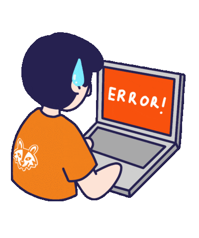

### I'm 

**Quality Engineer 
<br> Agentic AI Builder
<br>Community Builder**


<br clear="right"/>

<div align="center">

<a href="https://github.com/BeingHumanTester">
  
</a>

<br/>

<a href="https://www.linkedin.com/in/BeingHumanTester/"></a>
<a href="https://beinghumantester.com/"></a>
<a href="https://www.youtube.com/@BeingHumanTester/"></a>
<a href="mailto:automatealchemist@gmail.com"></a>

</div>

<br/>

<details open>
<summary><h2>Issue Tracker — About Me</h2></summary>

| # | Title | Labels | Status |
| :-- | :-- | :-- | :-- |
| #001 | Doesn't fully trust "it works on my machine" | `skepticism` `evidence-based` |  |
| #002 | Prompts AI agents to investigate failures, not just run scripts | `agentic-testing` `ai` |  |
| #003 | Building an AI interview-prep assistant that grades reasoning | `side-project` `interviews` |  |
| #004 | Writes about QA + AI on Substack instead of keeping notes private | `writing` `substack` |  |
| #005 | Used to just write test cases. Now asks *why* things break | `career-growth` |  |


</details>

<details open>
<summary><h2>Journey So Far</h2></summary>

```
2019 ─ Started as a manual tester
        │ Learned to break things before users could
        │
2021 ─ Moved into automation
        │ Selenium, Pytest, CI pipelines
        │
2023 ─ Started asking "why," not just "what failed"
        │ Root-cause diagnostics over pass/fail reports
        │
2024 ─ Started writing prompts, not just test cases
        │ Prompt engineering for structured, testable AI output
        │
2025 ─ Evaluating LLMs, not just web applications
        │ Testing model behaviour, reasoning, and failure modes
        │
2026 ─ Now: teaching AI agents to investigate
        └ Agentic testing, autonomous root-cause analysis
```

<br/>


</details>

<details open>
<summary><h2>How My AI Agent Investigates a Failure</h2></summary>


<sub>The loop behind my <strong>Agentic Testing Framework</strong> project — an AI agent doing the root-cause investigation on its own, escalating to a human only when it isn't confident.</sub>

<br/>


</details>

<details open>
<summary><h2>Test Coverage Report — Skills</h2></summary>

```
$ pytest --cov=beinghumantester --cov-report=term

Automation & Testing
  Python           ████████████████████  96%
  Selenium         ███████████████████░  92%
  Playwright       █████████████████░░░  85%
  Pytest           ██████████████████░░  88%

AI & Backend
  FastAPI          ██████████████░░░░░░  70%
  PyTorch          ████████████░░░░░░░░  60%
  OpenAI / LLMs     ████████████████░░░░  80%
  MCP              █████████████░░░░░░░  65%

DevOps & CI/CD
  Docker           ███████████████░░░░░  75%
  Jenkins          █████████████░░░░░░░  65%
  GitHub Actions   ████████████████░░░░  80%
  Git              ████████████████████  98%

------------------------------------------------
TOTAL                                     80%   PASSED
```

<br/>


</details>

<details open>
<summary><h2>Active Experiments & Flagship Projects</h2></summary>

<table>
<tr>
<td width="50%" valign="top">

**Pytest + Selenium Diagnostics** &nbsp; 
> Automated failure root-cause analysis
- Captures DOM state, browser logs, and network telemetry automatically on failure
- Turns raw stack traces into actionable reports

</td>
<td width="50%" valign="top">

**AI Interview Prep Assistant** &nbsp; 
> Evaluating reasoning over memorization
- Scenario-driven AI interviewer
- Scores problem-solving pathways, not keyword matches

</td>
</tr>
<tr>
<td width="50%" valign="top">

**Agentic Testing Framework** &nbsp; 
> Autonomous QA agents
- Runs exploratory test loops on its own
- Classifies crashes and reasons about root cause

</td>
<td width="50%" valign="top">

**Field Notes & Media** &nbsp; 
> Thought leadership in QA & AI
- Long-form essays on automation architecture
- Talks & workshops on AI in testing

</td>
</tr>
</table>

<br/>


</details>


<br/>

<details open>
<summary><h2>GitHub Telemetry</h2></summary>

<div align="center">

<a href="https://github.com/BeingHumanTester?tab=followers"></a>


<sub>GitHub's own Achievement badges (Pull Shark, Quickdraw, etc.) are earned automatically from activity and can't be embedded in a README — they show natively on your profile page as you merge more PRs.</sub>

<br/><br/>


<br/><br/>


</div>

<br/>


</details>

<details open>
<summary><h2>Recent Activity</h2></summary>

<!--START_SECTION:activity-->
<!--END_SECTION:activity-->

<sub>Populated automatically by <a href="https://github.com/jamesgeorge007/github-activity-readme">jamesgeorge007/github-activity-readme</a> — add the action's workflow to this repo once, and your last 5 GitHub events (PRs, issues, commits) will refresh here on every push.</sub>

</details>

<br/>

## Words I Test By

<table>
<tr>
<td width="60%" valign="top">

> "Information is power. But like all power, there are those who want to keep it for themselves."
> — Aaron Swartz

</td>
<td width="40%" valign="top">

```
$ ./run_tests.sh
> When I don't test the code,
> I code to test the code.
```

</td>
</tr>
</table>

## Let's Connect & Collaborate

<div align="center">

I'm always open to discussing **test architecture, agentic AI frameworks, or quality engineering strategy**.

<a href="mailto:automatealchemist@gmail.com"></a>

<br/><br/>


</div>
