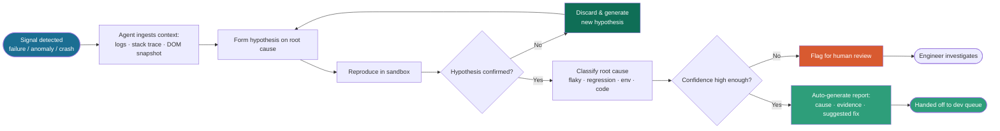

<div align="center">


<a href="https://github.com/BeingHumanTester">
  
</a>

<br/>

<a href="https://www.linkedin.com/in/BeingHumanTester/"></a>
<a href="https://substack.com/@BeingHumanTester"></a>
<a href="https://www.youtube.com/@BeingHumanTester/"></a>
<a href="mailto:automatealchemist@gmail.com"></a>

</div>

<br/>

## About Me — BeingHumanTester

```
$ cat about_me.txt

ROLE         : Quality Engineer & Automation Builder
ALIAS        : BeingHumanTester
CURRENT GOAL : Turning fragile test suites into self-diagnosing systems
PHILOSOPHY   : I trust logs less than I trust reproducing the bug myself.

[CORE FOCUS AREAS]
 - Intelligent Automation : deep failure diagnostics (DOM snapshots, network logs, visual diffs)
 - Agentic Testing & QA   : prompting and evaluating LLM agents that investigate failures on their own
 - Building in Public     : an AI interview-prep assistant that scores reasoning, not keyword matches
 - Technical Writing      : engineering deep dives on Substack
```

<br/>


## How My AI Agent Investigates a Failure



<sub>This is the loop behind my <strong>Agentic Testing Framework</strong> project — an AI agent doing the root-cause investigation on its own, escalating to a human only when it isn't confident.</sub>

<br/>

## Tech Stack & Arsenal

<div align="center">

| Category | Languages & Tools |
| :--- | :--- |
| **Automation & Testing** |  |
| **AI & Backend** |    |
| **DevOps & CI/CD** |  |
| **Ecosystem & OS** |  |

</div>

<br/>

## Active Experiments & Flagship Projects

<table>
<tr>
<td width="50%" valign="top">

### Pytest + Selenium Diagnostics
> **Automated failure root-cause analysis**
- Captures DOM state, browser logs, and network telemetry automatically on failure
- Turns raw stack traces into actionable reports

</td>
<td width="50%" valign="top">

### AI Interview Prep Assistant
> **Evaluating reasoning over memorization**
- Scenario-driven AI interviewer
- Scores problem-solving pathways, not keyword matches

</td>
</tr>
<tr>
<td width="50%" valign="top">

### Agentic Testing Framework
> **Autonomous QA agents**
- Runs exploratory test loops on its own
- Classifies crashes and reasons about root cause

</td>
<td width="50%" valign="top">

### Field Notes & Media
> **Thought leadership in QA & AI**
- Long-form essays on automation architecture
- Talks & workshops on AI in testing

</td>
</tr>
</table>

<br/>

## GitHub Telemetry

<div align="center">

<a href="https://github.com/BeingHumanTester?tab=followers"></a>


<sub>GitHub's own Achievement badges (Pull Shark, Quickdraw, etc.) are earned automatically from activity and can't be embedded in a README — they show natively on your profile page as you merge more PRs.</sub>

<br/><br/>


<br/><br/>


</div>

<br/>

## Words I Test By

<table>
<tr>
<td width="60%" valign="top">

> "Information is power. But like all power, there are those who want to keep it for themselves."
> — Aaron Swartz

</td>
<td width="40%" valign="top">

```
$ ./run_tests.sh
> When I don't test the code,
> I code to test the code.
```

</td>
</tr>
</table>

## Let's Connect & Collaborate

<div align="center">

I'm always open to discussing **test architecture, agentic AI frameworks, or quality engineering strategy**.

<a href="mailto:automatealchemist@gmail.com"></a>

<br/><br/>


</div>
