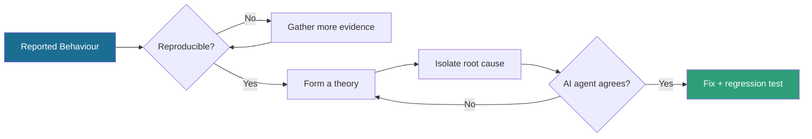

<div align="center">


<a href="https://github.com/beinghumantester">
  
</a>

<br/>

<a href="https://www.linkedin.com/in/beinghumantester/"></a>
<a href="https://substack.com/@beinghumantester"></a>
<a href="https://www.youtube.com/@beinghumantester/"></a>
<a href="mailto:automatealchemist@gmail.com"></a>

</div>

<br/>

## About Me — The "Automate Alchemist"

```
$ cat about_me.txt

ROLE         : Quality Engineer & Automation Builder
ALIAS        : The "Automate Alchemist"
CURRENT GOAL : Turning fragile test suites into self-diagnosing systems
PHILOSOPHY   : I trust logs less than I trust reproducing the bug myself.

[CORE FOCUS AREAS]
 - Intelligent Automation : deep failure diagnostics (DOM snapshots, network logs, visual diffs)
 - Agentic Testing & QA   : prompting and evaluating LLM agents that investigate failures on their own
 - Building in Public     : an AI interview-prep assistant that scores reasoning, not keyword matches
 - Technical Writing      : engineering deep dives on Substack
```

<br/>

## How I Investigate a Bug



```python
class BugInvestigator:
    def __init__(self, bug_report, ai_agent):
        self.report = bug_report
        self.agent = ai_agent

    def resolve(self):
        evidence = self.report.gather_artifacts()
        while not self.report.is_reproducible():
            evidence.extend(self.report.fetch_more_logs())

        root_cause = self.isolate_root_cause(evidence)
        verdict = self.agent.evaluate_failure(root_cause)

        if verdict.agrees_with(root_cause):
            return self.deploy_fix_and_regression_tests()
        return self.resolve()
```

<br/>

## Tech Stack & Arsenal

<div align="center">

| Category | Languages & Tools |
| :--- | :--- |
| **Automation & Testing** |  |
| **AI & Backend** |    |
| **DevOps & CI/CD** |  |
| **Ecosystem & OS** |  |

</div>

<br/>

## Active Experiments & Flagship Projects

<table>
<tr>
<td width="50%" valign="top">

### Pytest + Selenium Diagnostics
> **Automated failure root-cause analysis**
- Captures DOM state, browser logs, and network telemetry automatically on failure
- Turns raw stack traces into actionable reports

</td>
<td width="50%" valign="top">

### AI Interview Prep Assistant
> **Evaluating reasoning over memorization**
- Scenario-driven AI interviewer
- Scores problem-solving pathways, not keyword matches

</td>
</tr>
<tr>
<td width="50%" valign="top">

### Agentic Testing Framework
> **Autonomous QA agents**
- Runs exploratory test loops on its own
- Classifies crashes and reasons about root cause

</td>
<td width="50%" valign="top">

### Field Notes & Media
> **Thought leadership in QA & AI**
- Long-form essays on automation architecture
- Talks & workshops on AI in testing

</td>
</tr>
</table>

<br/>

## Trophy Case

<div align="center">


<sub>GitHub's own Achievement badges (Pull Shark, Quickdraw, etc.) are earned automatically from your activity and can't be embedded in a README — they show natively on your profile as you rack up merged PRs, so no action needed there.</sub>

</div>

## GitHub Telemetry

<div align="center">


<br/><br/>


</div>

<br/>

## Let's Connect & Collaborate

<div align="center">

I'm always open to discussing **test architecture, agentic AI frameworks, or quality engineering strategy**.

<a href="mailto:automatealchemist@gmail.com"></a>

<br/><br/>


</div>
